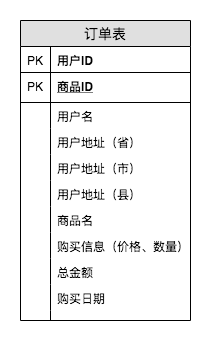
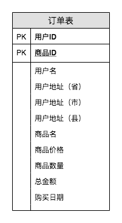
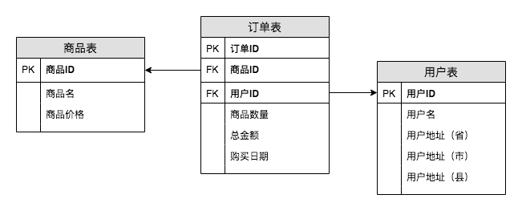
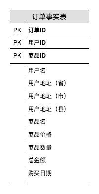

> 智者和愚人都没有害，最危险的倒是智愚参半。

## 0x00 概述

长期从事数据仓库的你，是否还记得数据库设计中的三大范式？在设计数据仓库的表时，是否考虑过规范化和反规范化之间的区别？是否想过数据仓库和数据库在设计中对范式考虑的侧重点是什么？

本文，将包含如下几个方面：

1. 一起回顾数据库设计中经典的三大范式
2. 聊一聊数据仓库和范式之间的关系
3. 聊一聊数据仓库和数据库在范式设计中的侧重点

全文将会围绕一个订单表（假设一个订单中只有一种商品出现）设计的例子，既有数据库中表的设计，亦有数据仓库中表的设计，一个例子贯穿全文，有始有终，简单易懂。

## 0x01 三范式

首先回顾一下范式是什么：

> 设计关系数据库时，遵从不同的规范要求，设计出合理的关系型数据库，这些不同的规范要求被称为不同的范式，各种范式呈递次规范，越高的范式数据库冗余越小。
>
> 目前关系数据库有六种范式：第一范式（1NF）、第二范式（2NF）、第三范式（3NF）、巴斯-科德范式（BCNF）、第四范式(4NF）和第五范式（5NF，又称完美范式）。

数据库范式有这么多，但是在工作中常用到的一般是前三个范式，因此，本文将只举例分享第一、二、三范式。为了方便理解，先上一个关于各个范式核心点的图镇楼，后面的说明会参考该图来进行。

### 第零范式

我们暂且将第一种设计称为第零范式，它满足一个基本条件：**无重复数据**。

如下，是我们按照无范式设计的第一张订单表。虽说该设计将成为一个被挑毛病的坏孩子，但从设计上来看，仍是可被理解的。

如下表格，列几条数据作为例子，该设计的一个问题上字段“购买信息”里面包含了两部分内容：商品价格和购买数量。

|   用户ID   |    商品ID    | 用户地址（省） | 用户地址（市） | 用户地址（县） | 商品名  | 购买信息（价格，数量） | 总金额 | 购买日期 |
| :--------: | :----------: | :------------: | :------------: | :------------: | ------- | :--------------------: | ------ | :------: |
| user_0001  | product_0001 |      xx省      |      xx市      |      xx县      | 手机1号 |         200，5         | 1300   | 20181201 |
| order_0002 | product_0003 |      xx省      |      xx市      |      xx县      | 电脑1号 |        1000，1         | 1000   | 20181202 |
| order_0003 | product_0002 |      xx省      |      xx市      |      xx县      | 手机2号 |         100，5         | 500    | 20181204 |

### 第一范式

第一范式的核心在于 Atomic colums（cells have single value），即**属性不可分**。

该设计和第零范式的区别在于我们将“购买信息”这一个字段拆成了“购买单价”和“购买数量”两个字段，新表满足了第一范式。

### 第二范式

第二范式在第一范式的基础之上更进一层。第二范式需要确保数据库表中的每一列都和主键相关，而不能只与主键的某一部分相关（主要针对联合主键而言）。即在第一范式的基础上满足**属性完全依赖于主键**。

以第一范式中的设计为例，商品数量、总金额和购买日期是**完全依赖**于（用户ID，商品ID）的，但是商品名和商品价格只依赖于商品ID，用户信息只依赖于用户ID，这属于**部分依赖**。

因此，将用户信息和商品信息单独拎出来后，我们的订单表设计就变成了如下三张表：订单表，商品表和用户表。

直观一点来理解第二范式的话，就是说一个数据表中只能保存一种数据，不可以把多种数据保存在同一张数据库表中。

### 第三范式

第三范式需要确保数据表中的每一列数据都和主键直接相关，而不能间接相关。即在第二范式的基础上满足**属性只直接依赖主键**。

以第二范式中的设计为例，现在订单表中的信息已经**完全依赖**于订单ID了，该设计是满足第二范式的。但是在用户表中，用户ID和地址信息是存在传递依赖的，即：用户ID决定地址ID，地址ID决定（省，市，县），这是**传递依赖**。

因此，我在地址信息表单独拎出来之后就可以设计出如下满足第三范式的表了。

## 0x02 数据仓库和三范式

以上，简单回顾了一下三范式的内容，下面将分析一下数据仓库中的数据建模和三范式之间的关系。

### 范式建模

范式建模是数据仓库之父 Bill lnmon 提出的建模方法是从全企业的高度设计一个第三范式的模型，用实体关系（Entity Relationship, ER）模型描述企业业务，**在范式理论上符合第三范式**。

因此我们可以认为数据仓库中的范式建模，在表的设计上和范式中的第三范式基本上一致的，具体到表的设计是可以如下内容。

### 维度建模

维度模型是数据仓库领域另一位大师 Ralph Kimball 所倡导，维度建模以**分析决策的需求**出发构建模型，构建的数据模型为分析需求服务，因此它重点解决用户如何更快速完成分析需求，同时还有较好的大规模复杂查询的响应性能。

维度建模的理论就不再细说，我们只介绍两个主要概念：**事实表和维度表**。

> 事实表：我们可以简单地将**事实**理解为现实中发生的一次操作型事件。比如订单表，我们就可以理解为一张事实表，我们每完成一个订单，就会在订单事实表中增加一条记录。
>
> 维度表：我们可以简单地理解维度表包含了事实表中指定属性的相关详细信息。比如商品维度表表和用户维度表。

那么用维度建模的方式进行设计的话，我们会设计如下三张表：订单事实表、商品维度表和用户维度表。这种设计，**在范式理论上符合第二范式**。

一般大家也会称维度建模是星星模型，可以将事实表当作是中间最大的一颗星星，维度表围绕在事实表周围。星星模型和雪花模型的主要区别在于**维度表是否都和事实表直接相连**。如下图，将我们的星星模型转换成了雪花模型，比如年维度表并不是直接连在订单事实表上，而是连在日期维度表上。

因此，简单点来讲，我们可以认为星星模型是将同一主题的维度信息冗余在了一张维表中。

### 有冗余的事实表

在维度建模中我们聊到了事实表的设计，它其实是符合第二范式的设计，但是在实际工作中我们经常会在事实表中存放更多的信息，以便更好地满足业务需求。

如下图，我们会将用户信息和商品信息都冗余到订单事实表中，在这种情况下，该事实表的设计**在范式理论上符合第一范式**。

## 0x03 数据仓库和数据库的侧重点

在大部分的数据仓库设计中，一般是不怎么考虑是否满足第几范式的，特别是互联网场景下的数据建设就更少考虑数据仓库和范式之间的关系，但是这并不妨碍我们去理解它们设计背后的出发点。至少我们可以搞明白为什么数据仓库设计不用过多关注范式。

我们这里聊到的数据库的设计，可以理解是联机事务处理OLTP（On-Line Transaction Processing），主要是基本的、日常的事务处理，例如银行交易。直白点讲，就是各种增删改查，需要对数据进行操作。而数据仓库，我们可以理解为是联机分析处理OLAP（On-Line Analytical Processing），主要是面向日常数据分析，它的数据主要是插入和查询，基本不涉及删除和修改操作。

本文的主人公-**范式**，主要优化的是增删改的问题，比如数据冗余、更新异常、删除异常等。这些也正是数据库设计比较关注的点。而数据仓库对这方面的关注度则比较少，数据仓库更关注的是使用是否方便，查询效率是否高，因此在设计数据仓库的时候不必太多关注范式的设计，一般第一或者第二范式就够用。

另外，数据仓库不同层级的设计也会用到不同的建模方式，比如说接近业务数据的层次，会更倾向使用范式建模，接近数据分析的层次则会更倾向于维度建模，这个话题会在数据分层的文章中有更详细的讲解。

## 0xFF 总结

本文主要是聊一聊数据仓库和范式之间的关系，算是对数据仓库相关理论的一种梳理。虽说对日常工作的影响不大，但是仍可以作为补充知识的学习。

